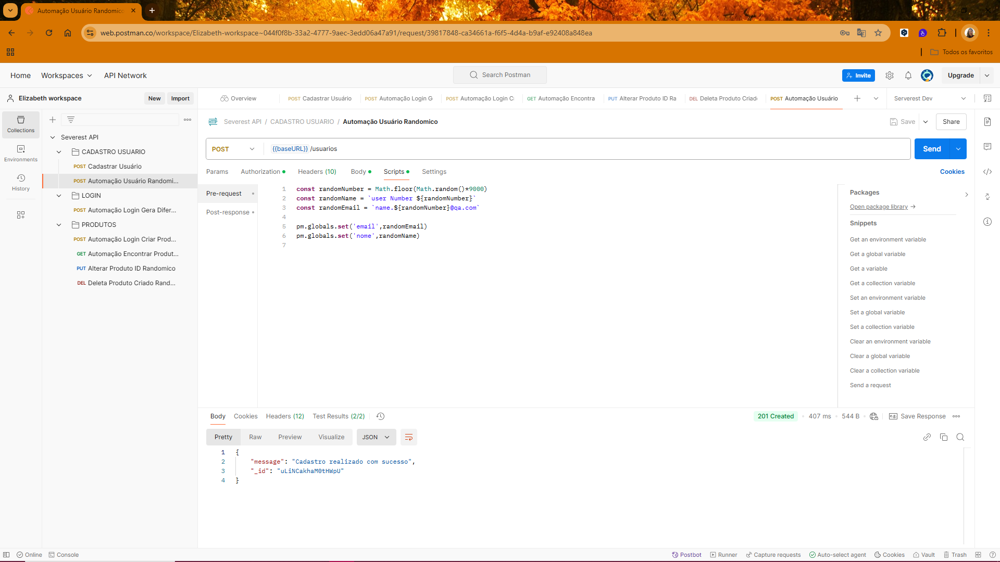

# 🚀 Cenário de Testes Automatizados com Postman

No repositório, você encontrará um cenário de teste completo desenvolvido com Postman, abrangendo as seguintes funcionalidades:

**1. Criação de Usuários Randômicos:** Automação para gerar usuários com dados aleatórios, garantindo maior realismo nos testes.

**2. Cadastro de Produtos Aleatórios:** Após criar o usuário, o cenário automatiza o registro de produtos com informações geradas dinamicamente.

**3. Busca de Produtos:** Verificação automatizada que permite localizar o produto criado, garantindo a integridade e funcionalidade do processo.

**4. Deleção de Produtos:** Encerrando o ciclo, o produto criado é deletado automaticamente, simulando o fluxo real de uso.


Esse projeto combina boas práticas de testes API com automação robusta, oferecendo um exemplo prático e eficiente para cenários de teste dinâmicos. 

**Este cenário foi exportado da minha "collections" direto do postman**

[Download Postman](https://www.postman.com/downloads/)

Cenário criado apartir do site 

[Serverest](https://serverest.dev/)

> **💡 NOTA:**

> Baixe o arquivo .json do repositório no GitHub.  [Automacao-Api-Postman-Testes](https://github.com/ElizabethGomes-QAEngineer/Automacao-Api-Postman-Testes/blob/main/Severest%20API.postman_collection.json)
> Baixe o arquivo da coleção do Postman:
> Abra o Postman, clique em Import e faça o upload do arquivo.
> Execute os testes.


# 📝 Passo a Passo para Importar a Coleção do Postman

**1. Acesse o Repositório no GitHub**
   
Abra o repositório no GitHub onde a coleção do Postman foi salva.
Navegue até o arquivo .json da coleção (Severest API.postman_collection.json).

**2. Baixe o Arquivo .json**
   
Clique no arquivo para abri-lo no GitHub.
Clique no botão Raw (em cima do arquivo).
O navegador exibirá o conteúdo do arquivo. Para baixar, clique com o botão direito do mouse e selecione Salvar como... para fazer o download do arquivo .json para o seu computador.

**3. Abra o Postman**
   
Execute o Postman no seu computador.

**4. Importe o Arquivo no Postman**
 
Na tela inicial do Postman, clique em Import (canto superior esquerdo).
Escolha a opção Upload Files.

Selecione o arquivo .json que você baixou (Severest API.postman_collection.json).
Clique em Open para importar.

**5. Coleção Importada**
Sua coleção do Postman aparecerá na aba Collections. Agora você pode rodar os testes de API


# 🎯 Como Realizar os Testes Dentro do Postman

Em "environments" configurar **globals** 

**1. "Variable"**

```bash
baseURL
```

**"Initial Value"/Current Value**

```bash
https://serverest.dev
```

**2. "Variable"**

```bash
user
```

**"Initial Value"/Current Value**

```bash
"qaenginieer419@qa.com.br"
```


**3. "Variable"**

```bash
password
```
**"Initial Value"/Current Value**

```bash
teste
```

**4. "Variable"**

```bash
accessToken
```

**5. "Variable"**

```bash
randomProductTest1
```

**"Initial Value"/Current Value**

```bash
randomProduct123
```

**6. "Variable"**

```bash
newProductId27
```

**7. "Variable"**
```bash
nome
```
**"Initial Value"/Current Value**

```bash
Elizabeth
```

# ⚙️ Passo a Passo Configurações 


1. Em **POST** Cadastro Usuario em **cadastrar usuário**
   alterar o email para  **"qaenginieer419@qa.com.br"**
   depois clicar em **"save"**
   

2. Em **POST** Login em **Automação Login Gera Diferentes Tokens**
  alterar o email para  **"qaenginieer419@qa.com.br"**
  depois clicar em **"save"**


3. Em **POST** Produtos em **Automação Login Criar Produto Rondomico**
   na aba **scripts** em **pre-request**
   alterar o email para  **"qaenginieer419@qa.com.br"**
   depois clicar em **"save"**
   

   vai gerar um Id do produto clicar neste ID e **copia**
   

4. Em **GET** produtos em **Automação Encontrar Produto ID**
   {{baseURL}}/produtos/ o id do produto que foi copiado
   depois clicar em **"save"**
   

5. Em **PUT** produtos em **Alterar Produto Id Randomico**
   {{baseURL}}/produtos/ o id do produto que foi copiado
   em body faz alteração de dados
   depois clicar em **"save"**


6. Em **DELETE** produtos em **Deletar Produto Criado Randomicamente**
   {{baseURL}}/produtos/ o id do produto que foi copiado
   depois clicar em **"save"**


# ✏️ Ordem para Executar os Testes dar um **"send"**

1. **POST** Cadastra Usuario
2. **POST** Automação Login Gera Diferentes Tokens
3. **POST** Automação Usuário Randomico
4. **POST** Automação Login Criar Produto Randomico
5. **GET** Automação Encontrar Produto ID
6. **PUT** Alterar Produto ID randomico
7. **DELETE** Deleta Produto Criado Randomicamente


**no caso de pesquisa de URL seria {{baseURL}}/  pode ser usuarios , login 
e produtos para colocar o id 
exemplo seria assim {{baseURL}}/produtos/IUpT2f0TSJGV5kB5**
   
